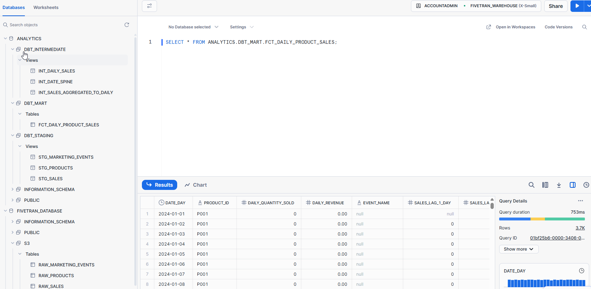

# End-to-End Cloud Data Pipeline: S3, Fivetran, Snowflake & dbt

This repository showcases a professional, end-to-end data pipeline built on a modern, cloud-native data stack. The project demonstrates how to automatically ingest raw files from a data lake (Amazon S3), load them into a cloud data warehouse (Snowflake) using a managed ELT service (Fivetran), and transform them into clean, reliable analytics models using dbt Core.

## Architecture: The Modern Data Stack in Action

This project implements a classic, robust ELT (Extract, Load, Transform) architecture that is a standard in the data industry today.

```
┌───────────────┐      ┌───────────────┐      ┌────────────────┐      ┌───────────────┐
│               │      │               │      │                │      │               │
│  Amazon S3    ├─────►│   Fivetran    ├─────►│   Snowflake    ├◄─────►│   dbt Core    │
│ (Data Lake)   │      │ (Ingestion)   │      │ (Data Warehouse) │      │(Transformation)│
│               │      │               │      │                │      │               │
└───────────────┘      └───────────────┘      └────────────────┘      └───────────────┘
```

1.  **Extract (Amazon S3):** Raw CSV files (`sales`, `products`, etc.) are uploaded to an S3 bucket, which acts as the data lake and a central landing zone for all source data.
2.  **Load (Fivetran):** A Fivetran connector is configured to automatically monitor the S3 bucket. When new files are detected, Fivetran handles schema detection, table creation, and loading the raw data into Snowflake.
3.  **Warehouse (Snowflake):** A scalable cloud data warehouse that stores both the raw data loaded by Fivetran and the final, transformed data models created by dbt.
4.  **Transform (dbt Core):** A local dbt project connects to Snowflake to run SQL-based transformations. This is where raw data is cleaned, tested, and modeled for business intelligence and analytics.

---

### Tech Stack

*   **Data Lake:** Amazon S3
*   **Data Ingestion:** Fivetran
*   **Data Warehouse:** Snowflake
*   **Data Transformation:** dbt (Data Build Tool)
*   **Cloud Security:** AWS IAM (Identity and Access Management)

---

### Key Skills & Concepts Demonstrated

This project is a practical demonstration of essential data engineering skills:

*   **Cloud Infrastructure:** Setting up and managing core cloud services on AWS (S3, IAM).
*   **Security Best Practices:** Configuring secure, keyless access for a third-party service using IAM Roles, an industry-standard security pattern.
*   **Automated Data Pipelines:** Using a managed ELT service (Fivetran) to build a robust, low-maintenance data ingestion pipeline that is resilient to schema changes.
*   **Cloud Data Warehousing:** Administering a Snowflake environment, including setting up databases, roles, and users, and managing access control with `GRANT` statements.
*   **Advanced Data Modeling:** Structuring a dbt project with clear staging, intermediate, and mart layers, and using techniques like date-spining to prepare data for time-series analysis.
*   **Data Quality & Testing:** Implementing tests at the source and model level within dbt to ensure data integrity throughout the pipeline.
*   **Troubleshooting:** Diagnosing and resolving real-world network and permission errors across multiple cloud platforms.

---

### How to Run This Project

To reproduce this project, you will need accounts for AWS, Fivetran, and Snowflake.

1.  **Prerequisites:**
    *   Install dbt Core (`pip install dbt-snowflake`).
    *   Configure your AWS credentials locally.
    *   Have access to a Snowflake account.

2.  **Configure the Infrastructure:**
    *   Follow the Fivetran documentation to create an S3 bucket, a Snowflake destination, and a Fivetran S3 connector using an IAM Role for authentication.

3.  **Clone and Configure dbt:**
    *   Clone this repository to your local machine.
    *   Set up your `~/.dbt/profiles.yml` file to connect to your Snowflake account using a dedicated `DBT_USER` and `DBT_ROLE`.

4.  **Run the Pipeline:**
    *   Upload your raw CSV files to the S3 bucket.
    *   Trigger the Fivetran sync to load the data into Snowflake.
    *   Navigate to the dbt project directory in your terminal and run the following commands:
    ```
    # Test the connection to Snowflake
    dbt debug

    # Run all models to transform the data
    dbt run

    # Execute all data quality tests
    dbt test
    ```

---

### Data Lineage

The following diagram shows the flow of data from the raw sources through the staging and intermediate models.




```
